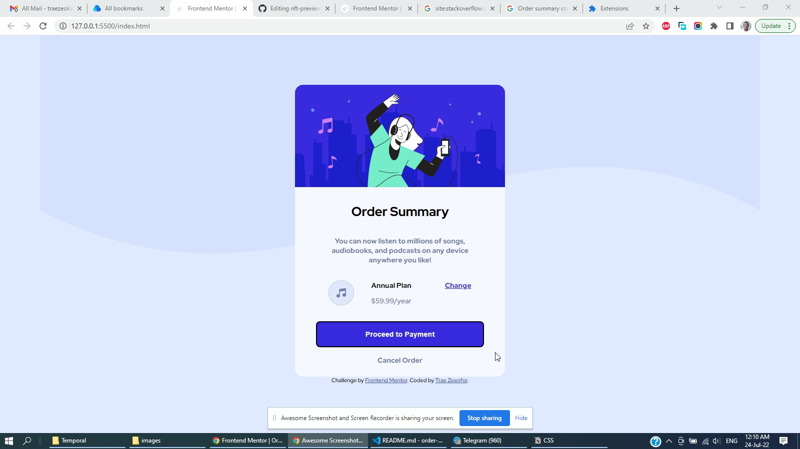

# Frontend Mentor - Order summary card solution

This is a solution to the [Order summary card challenge on Frontend Mentor](https://www.frontendmentor.io/challenges/order-summary-component-QlPmajDUj). Frontend Mentor challenges help you improve your coding skills by building realistic projects. 

## Table of contents

- [Overview](#overview)
  - [The challenge](#the-challenge)
  - [Screenshot](#screenshot)
  - [Links](#links)
- [My process](#my-process)
  - [Built with](#built-with)
  - [What I learned](#what-i-learned)
  - [Continued development](#continued-development)
  - [Useful resources](#useful-resources)
- [Author](#author)
- [Acknowledgments](#acknowledgments)

## Overview

### The challenge

Users should be able to:

- See hover states for interactive elements

### Screenshot

### Links

- Solution URL: [https://github.com/traez/order-summary-component-main](https://github.com/traez/order-summary-component-main)
- Live Site URL: [https://traez.github.io/order-summary-component-main/](https://traez.github.io/order-summary-component-main/)

## My process

### Built with

- Semantic HTML5 markup
- CSS custom properties
- Flexbox
- Mobile-first workflow

### What I learned

Became much better at structure setup, so no really lengthy periods of confusion.
Plus I swiftly turned to StackOverflow this time around for smarter clarifications.

### Continued development

Still much learning to understand best practice as regards mobile-view-build. 
Couldn't quite attain it this once.

### Useful resources

Special shout outs to StackOverflow

## Author

- Website - [Trae Zeeofor](https://github.com/traez)
- Frontend Mentor - [@traez](https://www.frontendmentor.io/profile/traez)
- Twitter - [@trae_z](https://twitter.com/trae_z)

## Acknowledgments

Respect to Jah Almighty for life.
